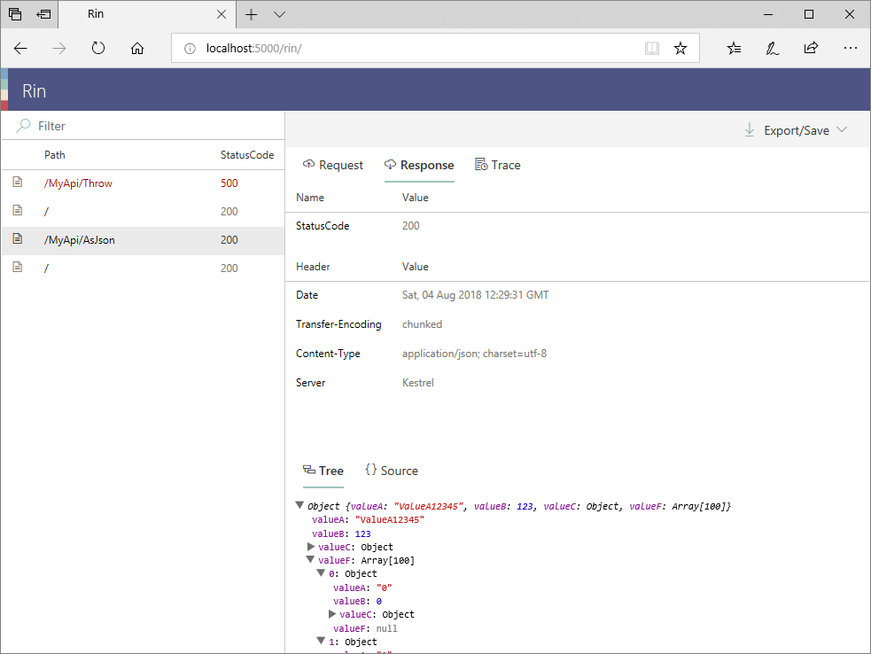

# Rin
**R**equest/response **In**spector for ASP.NET Core. like Fiddler on a web server.

Rin captures HTTP requests to ASP.NET Core app and provides viewer for captured data. It's useful tool to debug your Web application.



# Features
- 📼 Recording requests and responses
    - Including...
        - Traces (`Microsoft.Extensions.Logging.ILogger`)
        - Unhandled Exception
- 🌎 Inspection from Web browser
    - ⚡ Realtime (powered by WebSocket)
    - 🔍 Preview a request/response body
        - JSON as tree view
        - Image view (PNG, JPEG, SVG, ...)
        - Syntax highligting (powered by Monaco Editor)

# Requirements
- .NET Core 2.0 or later
- ASP.NET Core 2.1 or later
- Modern browser (e.g. Microsoft Edge, Google Chrome, Firefox, Safari...)
    - WebSocket connectivity

# QuickStart

## Install NuGet Package
### Using Visual Studio
`Dependencies` -> `Manage NuGet Packages...` -> Search and install `Rin` package.

### Using dotnet command
```
dotnet add package Rin
```

### Using Package Manager
```
Install-Package Rin
```

## Setup and configure Rin

### Program.cs
```csharp
public static IWebHostBuilder CreateWebHostBuilder(string[] args) =>
    WebHost.CreateDefaultBuilder(args)
        .ConfigureLogging(configure =>
        {
            // Add: Enable Rin Logger
            configure.UseRinLogger();
        })
        .UseStartup<Startup>();
```

### Startup.cs

```csharp
public class Startup
{
    ...
    public void ConfigureServices(IServiceCollection services)
    {
        ...
        
        services.AddMvc().SetCompatibilityVersion(CompatibilityVersion.Version_2_1);

        // Add: Register Rin services
        services.AddRin();
    }
    ...
    public void Configure(IApplicationBuilder app, IHostingEnvironment env)
    {
        if (env.IsDevelopment())
        {
            // Add: Enable request/response recording and serve a inspector frontend.
            // Important: `UseRin` (Middlewares) must be top of the HTTP pipeline.
            app.UseRin();

            app.UseDeveloperExceptionPage();

            // Add: Enable Exception recorder. this handler must be after `UseDeveloperExceptionPage`.
            app.UseRinDiagnosticsHandler();
        }
        ...
    }
}
```

## Start the application and open Inspector on the web

Launch the app, then open `http://[Host:Port]/rin/` in the browser, you can see Rin Inspector now.

# Develop and build Rin Inspector (frontend)
The front-end codes for Rin is separated from Rin core C# project. If you want to develop Rin or launch a sample project, you need to build and pack the codes.

## Setup and start the development server
- `npm install`
- `npm run start`

## Build Rin/Resources.zip
- `npm run build`
- `npm run pack`